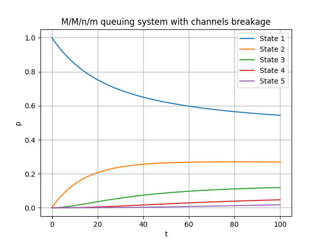

# queuing-systems

## Requirements

- Python 3.8.5+

## How to run

1. Clone this repo to the desired directory

1. To install required packages run:

    ```Bash
    pip3 install -r requirements.txt 
    ```

    or

    ```Bash
    make reqs
    ```

1. To run the code use:

    ```Bash
    python3 main.py
    ```

    or

    ```Bash
    make start
    ```

## Example output



```txt
Reduced demand flow rate:  0.4
Average time of demand in the queue:  2.0
Average number of demands in the queue:  0
The rate of withdrawal of claims from the queuing system without service:  0.5
Absolute throughput of the queuing system:  2.0
Relative throughput of the queuing system:  1.0
Average number of busy channels:  2.0
Productivity loss due to breakage:  0.2581738904486369
```

## Environmental variables

| Environmental Variable |                                 Description                                | Default value |
|:----------------------:|:--------------------------------------------------------------------------:|:-------------:|
|         LAMBDA         |                        Intensity of the demands flow                       |       2       |
|           MU           |         The intensity of the simplest service flow of each channel         |       1       |
|           NU           | The rate of withdrawal of claims from the queuing system without  service  |      0.5      |
|        CHANNELS        |                   Number of the queuing system  channels                   |       5       |
|          STEPS         |             Number of steps for Runge-Kutta ODE system solving             |     10000     |
|     MAX_QUEUE_SIZE     |                           Maximum queue capacity                           |       5       |
|       MU_SERVICE       |         The intensity of the simplest breakage flow of each channel        |       4       |
|     LAMBDA_SERVICE     |                       Intensity of the breakage flow                       |       6       |
|    NUMBER_OF_WORKERS   |                    Number of workers repairing channels                    |       2       |
